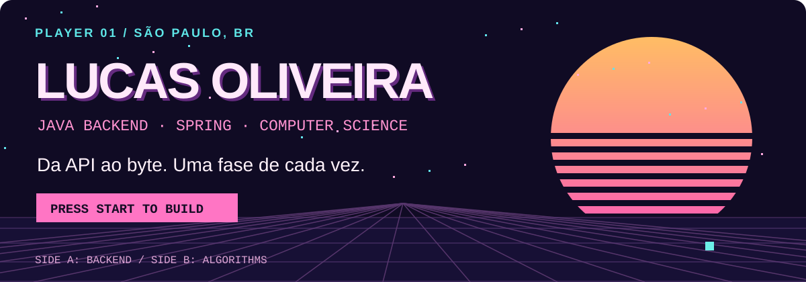
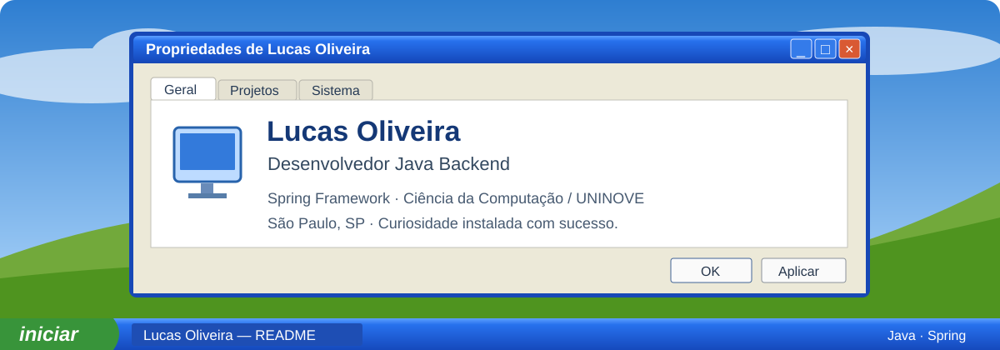
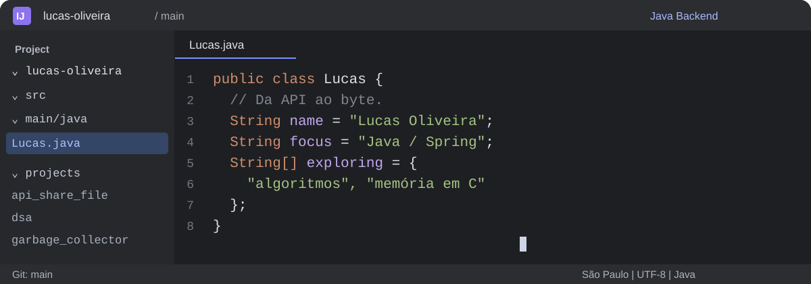

# Lucas Oliveira / cinco universos

Cinco READMEs completos para o mesmo desenvolvedor. Cada um tem uma composição, uma voz e um banner próprios; todos mostram projetos e dados públicos reais.

| Tema | Direção | Abrir |
| :--- | :--- | :--- |
| **80/90** | Arcade, pôr do sol neon, inventário e seleção de fases | [Ver README](themes/retro/README.md) |
| **Futurama** | Central de entregas interplanetárias, nave e telemetria | [Ver README](themes/futurama/README.md) |
| **Windows XP** | Área de trabalho, propriedades do sistema e Meus documentos | [Ver README](themes/windows-xp/README.md) |
| **IntelliJ** | Editor Java, árvore de projetos e painel Git | [Ver README](themes/intellij/README.md) |
| **Minimalista** | Papel claro, verde, espaço e uma ideia: da API ao byte | [Ver README](themes/minimalista/README.md) |

## 01 / Anos 80 e 90

## 02 / Futurama

## 03 / Windows XP

## 04 / IntelliJ

## 05 / Minimalista

## Escolher e personalizar

O tema inicial desta proposta é **IntelliJ**. A configuração fica em `profile.config.json`. Os cinco arquivos permanecem disponíveis para comparação e os links do topo navegam entre eles.

[Como trocar o tema e ativar as atualizações →](SETUP.md)
